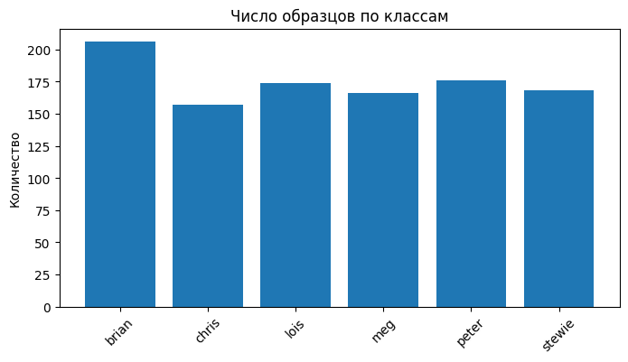

<!-- PROJECT LOGO -->
<br />
<p align="center">
  
  <h3 align="center">Family Guy Characters Classification</h3>
</p>

<p align="center">
  <a href="https://github.com/703lovelost/"><b>Aleksey Spirkin</b></a>
  <br />
  Deep Robotics Institute
  <br />
  Novosibirsk State University
</p>

<!-- TABLE OF CONTENTS -->
<details open="open">
  <summary>Table of contents</summary>
  <ol>
    <li><a href="#About">About</a></li>
    <li><a href="#Run">Run</a></li>
  </ol>
</details>

## About

Inference solution for Family Guy characters classification. There are 6 characters currently supported:

* Peter
* Lois
* Meg
* Chris
* Brian
* Stewie

Based on the private self-collected dataset - TBA.

### Dataset

The dataset size is listed below.



### Classification report

Classification report on validation set.
```
              precision    recall  f1-score   support

       brian       0.81      0.93      0.86        41
       chris       0.97      0.91      0.94        32
        lois       0.83      0.86      0.85        35
         meg       0.90      0.85      0.88        33
       peter       0.97      0.83      0.89        35
      stewie       0.92      0.97      0.94        34

    accuracy                           0.89       210
   macro avg       0.90      0.89      0.89       210
weighted avg       0.90      0.89      0.89       210
```

## Run

To run the inference:
```
python3 infer.py [IMG_PATH]
```

## P.S.

This project is dedicated to Ivan Nikitin and his everlasting love of watching Family Guy Funny Moments compilations.